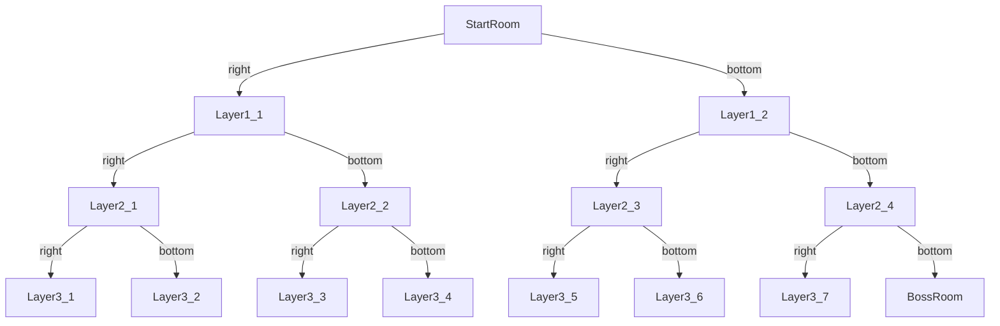

# **线性代数要学不完了队**

## **Membership Information**
    1. 潘佑邦 2024533070
    2. 吴俊阳 2024533080
    3. 宋梓冬 2024533002

## **Division of Labor among Members**
    1.潘佑邦:
    2.吴俊阳:
    3.宋梓冬: README.md

## **Game Overview**
Game Name: **The Binding of Issac**  
Game Type: **Roguelike**  
Game Dimension: **2D**

## **Game Objectives**
    Go into every room, 
    kill all monsters, 
    become as strong as possible, 
    kill the final boss...
    AND THEN ?

## **INSTRUCTION : Operations**
    1. WASD : Eight directions of uniform speed
    2. ↑↓←→ : Eight directions firing
    3. LSHIFT : Run
    4. Q : Interact with the raffle machine / Trainer
    5. E : Plant a bomb
## **INTRODUCTION**
### Introduction : Map
    1. MapTree：We use a binary tree to implement the map: random generation + iterative backtracking
    2. After removing Enemies from each map, the remaining rooms will open
    3. Room Type：CommonRoom + BossRoom + ShopRoom + TrainerRoom

### Introduction : Resource System (UI)
    1. Health : Displays the value of the health bar
    2. Coin : Displays the number of the gold coin
    3. Attack :  Displays the value of the gold coin
    4. Bomb : Displays the number of the gold coin
   
### Introduction : Enemies
    1. Fly/BloodyFly : A Flying unit that move randomly
    2. Bug :  A land unit that sprints randomly in four directions
    3. Boss(GURDY) : A special unit that fires bloodybullets and summons bloodyflies
   
### Introduction : Raffle machine  
    1.  Cost 5 Coin
    2.  +3 Coin
    3.  +1 Attack
    4.  +2 HP
   
### Introduction : Trainer  
    Please answer the questions correctly !
   

## ANIMATION is the SOUL of GAME !